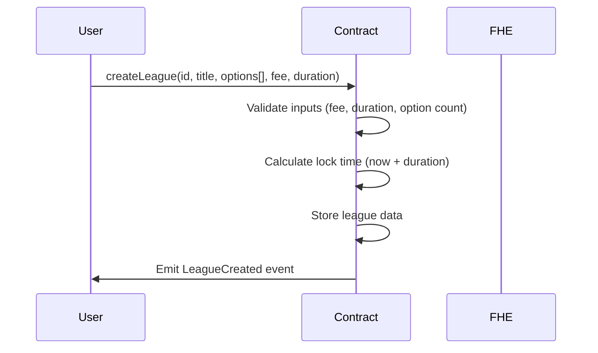
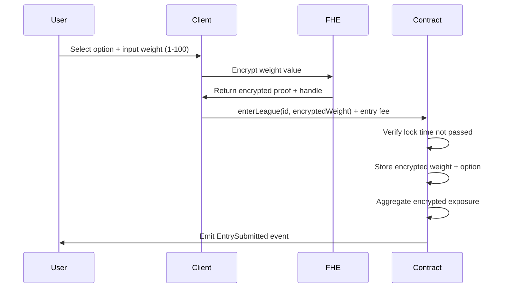
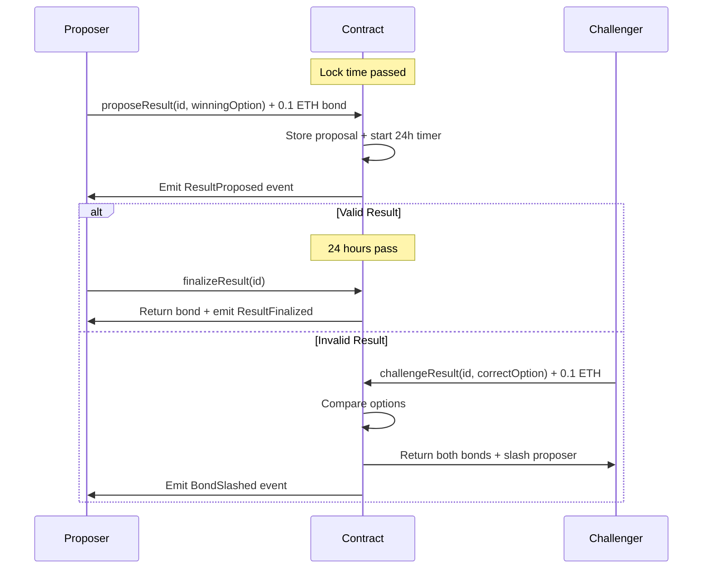
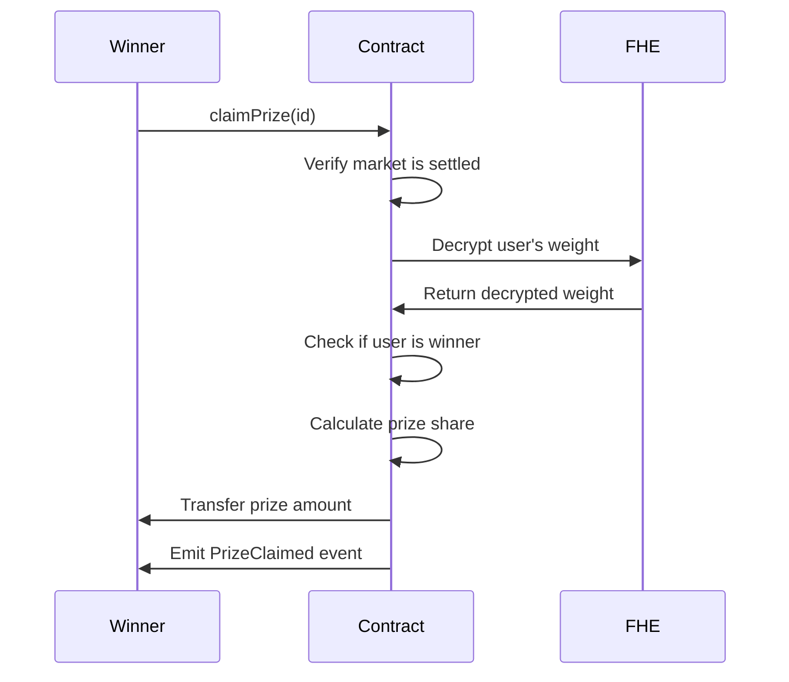
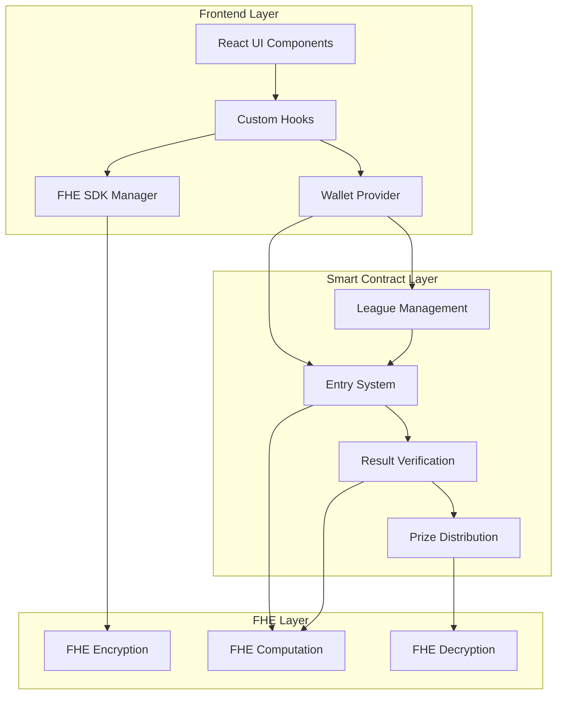

# Atlas Predictive League

> **Live Demo**: [https://atlaspredictiveleague.vercel.app](https://atlaspredictiveleague.vercel.app)

## Demo Video

Watch the platform in action - see how users create prediction markets, place encrypted bets with confidence weights, challenge results, and claim prizes:

https://github.com/user-attachments/assets/demo.mp4

*The video demonstrates the complete user journey including market creation, encrypted betting with privacy-preserving confidence weights, decentralized result verification with challenge mechanism, and secure prize distribution.*

---

## Table of Contents

- [Overview](#overview)
- [The Problem & Solution](#the-problem--solution)
- [What is Fully Homomorphic Encryption (FHE)?](#what-is-fully-homomorphic-encryption-fhe)
- [Key Features](#key-features)
- [How It Works](#how-it-works)
- [System Architecture](#system-architecture)
- [Smart Contract Design](#smart-contract-design)
- [Technology Stack](#technology-stack)
- [Getting Started](#getting-started)
- [API Documentation](#api-documentation)
- [Security Model](#security-model)
- [Roadmap](#roadmap)
- [Contributing](#contributing)
- [License](#license)

---

## Overview

**Atlas Predictive League** is a decentralized prediction market platform that leverages **Zama's Fully Homomorphic Encryption (FHE)** technology to enable privacy-preserving betting with confidence weights. Unlike traditional prediction markets where bet amounts are publicly visible, Atlas allows users to encrypt their confidence levels (1-100) on-chain, ensuring true privacy until results are finalized.

The platform combines:
- **Privacy**: Encrypted confidence weights using Zama fhEVM
- **Decentralization**: Challenge-based result verification with economic incentives
- **Fairness**: Time-locked markets with editable entries before lock time
- **Transparency**: All operations are on-chain and verifiable

---

## The Problem & Solution

### The Problem

Traditional prediction markets face several critical issues:

1. **Lack of Privacy**: Bet amounts and choices are publicly visible, enabling:
   - Front-running attacks
   - Market manipulation through visible whale positions
   - Social pressure and privacy concerns

2. **Centralized Result Verification**: Most platforms rely on:
   - Centralized oracles for result determination
   - Single points of failure
   - Potential manipulation by operators

3. **Binary Betting**: Many platforms only support simple yes/no or fixed amount betting, lacking:
   - Confidence-weighted predictions
   - Flexible betting strategies
   - Nuanced market participation

### Our Solution

Atlas Predictive League addresses these issues through:

1. **Encrypted Confidence Weights**:
   - Users submit encrypted values (1-100) representing their confidence
   - Weights remain private on-chain until settlement
   - Enables sophisticated betting strategies without revealing positions

2. **Decentralized Result Verification**:
   - Anyone can propose results by posting a bond (0.1 ETH)
   - 24-hour challenge period for community verification
   - Economic incentives align behavior (bond slashing for incorrect proposals)
   - No reliance on centralized oracles

3. **Flexible Market Design**:
   - Support for multiple options (up to 10 choices)
   - Editable entries before lock time
   - Customizable market duration (1 hour to 30 days)
   - Fair prize distribution based on participation

---

## What is Fully Homomorphic Encryption (FHE)?

### FHE Fundamentals

**Fully Homomorphic Encryption (FHE)** is a revolutionary cryptographic technique that allows computations to be performed directly on encrypted data without decrypting it first. This means:

- **Compute on Encrypted Data**: Smart contracts can add, compare, and manipulate encrypted values
- **End-to-End Privacy**: Data remains encrypted from client to blockchain to settlement
- **Verifiable Results**: All operations are deterministic and on-chain verifiable

### How We Use FHE

In Atlas Predictive League, FHE powers three critical privacy features:

1. **Encrypted Weight Storage**:
```solidity
struct Entry {
    euint64 weightCipher;  // Encrypted confidence weight (1-100)
    uint8 optionId;        // Public choice
    bool claimed;          // Public claim status
}
```

2. **Private Aggregation**:
```solidity
// Add encrypted weights without revealing individual values
optionStats[optionId].exposure = FHE.add(
    optionStats[optionId].exposure,
    entry.weightCipher
);
```

3. **Encrypted Comparisons**:
```solidity
// Compare encrypted weights to determine winners
ebool isWinner = FHE.gt(entry.weightCipher, FHE.asEuint64(0));
```

### Why FHE Matters for Prediction Markets

Traditional approaches to privacy (zero-knowledge proofs, commit-reveal schemes) have limitations:

| Approach | Privacy Level | Smart Contract Computation | Complexity |
|----------|---------------|---------------------------|------------|
| **Plain Text** | ❌ None | ✅ Full | ✅ Simple |
| **Commit-Reveal** | ⚠️ Temporary | ⚠️ Limited | ⚠️ Moderate |
| **Zero-Knowledge Proofs** | ✅ High | ❌ None | ❌ Complex |
| **FHE (Our Solution)** | ✅ High | ✅ Full | ✅ Moderate |

**FHE uniquely enables privacy while maintaining smart contract computation capabilities**, making it ideal for prediction markets where both privacy and on-chain logic are essential.

---

## Key Features

### 🔐 Privacy-Preserving Betting

- **Encrypted Confidence Weights**: Submit bets with encrypted values (1-100) representing your confidence level
- **On-Chain Privacy**: Weights remain encrypted throughout the market lifecycle
- **No Front-Running**: Impossible for others to see or react to your betting strategy
- **Private Until Settlement**: Weights only revealed when computing final results

### 🎯 Flexible Market Design

- **Multiple Options**: Support for 2-10 betting options per market
- **Customizable Duration**: Markets can run from 1 hour to 30 days
- **Editable Entries**: Change your prediction and confidence weight before lock time
- **Fair Entry Fees**: Minimum 0.001 ETH to ensure serious participation

### ⚖️ Decentralized Result Verification

- **Challenge Mechanism**: 24-hour challenge period after result proposal
- **Economic Security**: 0.1 ETH bond required for proposals and challenges
- **Bond Slashing**: Incorrect proposers/challengers lose their bonds
- **Community-Driven**: No reliance on centralized oracles

### 💰 Fair Prize Distribution

- **Winner-Take-All Pool**: Prize pool distributed equally among winners
- **Refund Options**: Get refunds for cancelled markets or draws
- **Transparent Calculation**: All prize logic is on-chain and verifiable
- **Gas Efficient**: Optimized contract design for minimal gas costs

### 🛡️ Security Features

- **Time Locks**: Entries close at predefined times for fairness
- **Reentrancy Protection**: Safe against common smart contract attacks
- **Input Validation**: Comprehensive checks on all user inputs
- **Event Logging**: Complete audit trail for all market operations

---

## How It Works

### Phase 1: Market Creation



**Process:**
1. Creator specifies market details (title, options, entry fee, duration)
2. Contract validates parameters (fee ≥ 0.001 ETH, duration ≤ 30 days, options ≤ 10)
3. Lock time is set to current time + duration
4. Market is created and becomes available for betting

### Phase 2: Betting Period



**Process:**
1. User selects an option and inputs confidence weight (1-100)
2. Client-side FHE SDK encrypts the weight
3. User submits encrypted weight + entry fee to contract
4. Contract stores encrypted weight and aggregates it to option's total exposure
5. User can edit entry multiple times before lock time

**Key Privacy Feature:** The weight value is encrypted client-side and never exposed in plain text on-chain.

### Phase 3: Result Proposal & Challenge



**Process:**
1. After lock time, anyone can propose a result by posting 0.1 ETH bond
2. 24-hour challenge period begins
3. If challenged:
   - Challenger must also post 0.1 ETH bond
   - Contract verifies which option is correct
   - Incorrect party loses their bond
   - Correct party receives both bonds
4. If unchallenged for 24 hours, result is finalized

**Security Feature:** Economic incentives ensure honest behavior. Malicious proposals are expensive due to bond slashing.

### Phase 4: Prize Distribution



**Process:**
1. After result finalization, winners can claim prizes
2. Contract decrypts the user's weight (first time it's revealed)
3. Verifies user bet on winning option with weight > 0
4. Calculates equal share: `prizePool / winnerCount`
5. Transfers prize to winner
6. Marks claim as completed

**Privacy Reveal:** Individual weights are only decrypted during prize claiming, and only for the specific user claiming.

---

## System Architecture

### High-Level Architecture

```
┌─────────────────────────────────────────────────────────────┐
│                        User Interface                        │
│          (React + TypeScript + Vite + Tailwind)             │
└──────────────────────────┬──────────────────────────────────┘
                           │
                           ├─── Wallet Connection (RainbowKit)
                           ├─── FHE Encryption (Zama SDK)
                           └─── Contract Calls (Wagmi)
                           │
┌──────────────────────────┴──────────────────────────────────┐
│                    Blockchain Layer                          │
│                  (Ethereum Sepolia Testnet)                  │
│                                                              │
│  ┌────────────────────────────────────────────────────┐   │
│  │      AtlasPredictiveLeague Smart Contract          │   │
│  │                                                      │   │
│  │  ├─ Market Creation & Management                    │   │
│  │  ├─ Encrypted Entry Storage (FHE)                   │   │
│  │  ├─ Result Proposal & Challenge Logic               │   │
│  │  └─ Prize Distribution & Refunds                    │   │
│  └────────────────────────────────────────────────────┘   │
│                                                              │
│  ┌────────────────────────────────────────────────────┐   │
│  │         Zama fhEVM 0.8.0 Coprocessor               │   │
│  │                                                      │   │
│  │  ├─ FHE Operations (Add, Compare, Select)           │   │
│  │  ├─ Encrypted State Management                      │   │
│  │  └─ Decryption for Prize Claims                     │   │
│  └────────────────────────────────────────────────────┘   │
└──────────────────────────────────────────────────────────────┘
```

### Component Interaction Flow



### Data Flow

1. **Market Creation Flow**:
   ```
   User Input → Form Validation → Contract Call → Event Emission → UI Update
   ```

2. **Betting Flow**:
   ```
   Weight Input → Client Encryption → Proof Generation → Contract Storage →
   Encrypted Aggregation → Event Emission → UI Update
   ```

3. **Result Verification Flow**:
   ```
   Proposal Submission → Bond Lock → Challenge Period Start →
   [Challenge OR Timeout] → Result Finalization → Event Emission
   ```

4. **Prize Claiming Flow**:
   ```
   Claim Request → Weight Decryption → Winner Verification →
   Prize Calculation → Transfer → Event Emission
   ```

---

## Smart Contract Design

### Core Data Structures

```solidity
struct League {
    bool exists;             // Market existence flag
    string leagueId;        // Unique identifier
    string title;           // Market question/title
    string[] options;       // Array of betting options
    uint256 entryFee;       // Required entry fee in wei
    uint256 lockTime;       // Timestamp when betting closes
    uint256 prizePool;      // Accumulated prize pool
    bool cancelled;         // Cancellation status
    bool settled;           // Settlement status
    uint8 winningOption;    // Index of winning option (0-based)
    mapping(uint8 => OptionData) optionStats;  // Per-option statistics
}

struct OptionData {
    euint64 exposure;       // Encrypted sum of all weights for this option
    uint256 pickCount;      // Number of participants who picked this option
}

struct Entry {
    bool exists;            // Entry existence flag
    uint8 optionId;         // Chosen option (public)
    bool claimed;           // Prize claim status
    euint64 weightCipher;   // Encrypted confidence weight (private)
}

struct ResultProposal {
    address proposer;       // Address that proposed result
    uint8 proposedOption;   // Proposed winning option
    uint256 bondAmount;     // Bond amount (0.1 ETH)
    uint256 proposeTime;    // Timestamp of proposal
    bool challenged;        // Challenge status
    bool finalized;         // Finalization status
}

struct Challenge {
    address challenger;     // Address that challenged
    uint8 challengedOption; // Option challenger believes is correct
    uint256 bondAmount;     // Bond amount (0.1 ETH)
    uint256 challengeTime;  // Timestamp of challenge
}
```

### Key Contract Parameters

```solidity
// Constants
uint256 public constant MIN_ENTRY_FEE = 0.001 ether;  // Minimum bet amount
uint256 public constant MIN_DURATION = 1 hours;       // Minimum market duration
uint256 public constant MAX_DURATION = 30 days;       // Maximum market duration
uint8 public constant MAX_OPTIONS = 10;               // Maximum betting options
uint256 public constant CHALLENGE_BOND = 0.1 ether;   // Bond for proposals/challenges
uint256 public constant CHALLENGE_PERIOD = 24 hours;  // Duration of challenge window
```

### State Mappings

```solidity
mapping(string => League) private leagues;                    // leagueId => League data
mapping(string => mapping(address => Entry)) private entries; // leagueId => user => Entry
mapping(string => ResultProposal) private proposals;          // leagueId => Proposal
mapping(string => Challenge[]) private challenges;            // leagueId => Challenges array
string[] private leagueIds;                                   // List of all league IDs
```

### FHE Operations Used

| Operation | Description | Use Case |
|-----------|-------------|----------|
| `FHE.asEuint64()` | Convert plaintext to encrypted | Initial weight encryption |
| `FHE.add()` | Add encrypted values | Aggregate weights per option |
| `FHE.gt()` | Compare encrypted values | Check if weight > 0 |
| `FHE.select()` | Conditional selection | Choose prize based on winner status |
| `FHE.decrypt()` | Reveal encrypted value | Verify winners during prize claim |

---

## Technology Stack

### Smart Contract Layer

| Technology | Version | Purpose |
|------------|---------|---------|
| **Solidity** | 0.8.24 | Smart contract programming language |
| **Zama fhEVM** | 0.8.0 | FHE computation library |
| **Hardhat** | Latest | Development environment and testing |
| **OpenZeppelin** | Latest | Secure contract utilities |

### Frontend Layer

| Technology | Version | Purpose |
|------------|---------|---------|
| **React** | 18.3.1 | UI framework |
| **TypeScript** | 5.6.2 | Type-safe JavaScript |
| **Vite** | 5.4.10 | Build tool and dev server |
| **Tailwind CSS** | 3.4.14 | Utility-first CSS framework |
| **shadcn/ui** | Latest | High-quality UI components |

### Web3 Integration

| Technology | Version | Purpose |
|------------|---------|---------|
| **Wagmi** | 2.12.17 | React hooks for Ethereum |
| **RainbowKit** | 2.1.7 | Wallet connection UI |
| **Viem** | 2.x | Lightweight Ethereum client |
| **Zama RelayerSDK** | 0.3.0-5 | FHE client-side encryption |

### Development Tools

| Tool | Purpose |
|------|---------|
| **ESLint** | Code linting and style enforcement |
| **Prettier** | Code formatting |
| **TypeScript** | Static type checking |
| **Git** | Version control |
| **Vercel** | Deployment and hosting |

### Network Details

- **Blockchain**: Ethereum Sepolia Testnet
- **Contract Address**: `0xcE54867466234CFc066341AC323De0B89bdF8aad`
- **FHE Coprocessor**: Zama fhEVM Sepolia deployment
- **RPC Endpoint**: Public Sepolia RPC nodes

---

## Getting Started

### Prerequisites

- **Node.js**: v18.0.0 or higher
- **Package Manager**: npm or pnpm
- **Wallet**: MetaMask or compatible Ethereum wallet
- **Test ETH**: Sepolia testnet ETH (get from [faucet](https://sepoliafaucet.com/))

### Installation

1. **Clone the repository**:
```bash
git clone https://github.com/brarterofmorth/AtlasPredictiveLeague.git
cd AtlasPredictiveLeague
```

2. **Install dependencies**:
```bash
npm install
```

3. **Set up environment variables**:
```bash
# Create .env file
cp .env.example .env

# Add your configuration
PRIVATE_KEY=your_private_key_here
SEPOLIA_RPC_URL=https://ethereum-sepolia-rpc.publicnode.com
```

### Development

#### Smart Contract Development

```bash
# Compile contracts
npm run compile

# Run tests
npm test

# Deploy to Sepolia
npm run deploy

# Create sample markets
npm run create-leagues
```

#### Frontend Development

```bash
# Start development server (default port 3000)
npm run dev

# Build for production
npm run build

# Preview production build
npm run preview

# Type checking
npm run type-check

# Linting
npm run lint
```

### Project Structure

```
AtlasPredictiveLeague/
├── contracts/                    # Smart contracts
│   └── AtlasPredictiveLeague.sol # Main contract
│
├── scripts/                      # Deployment and utility scripts
│   ├── deploy.cjs               # Contract deployment
│   ├── create-leagues.cjs       # Create sample markets
│   ├── create-direct.cjs        # Direct contract interaction
│   └── create-one-30day-league.cjs
│
├── dapp/                        # Frontend application
│   ├── public/                  # Static assets
│   │   └── demo.mp4            # Demo video
│   │
│   ├── src/
│   │   ├── components/         # React components
│   │   │   ├── ui/            # shadcn/ui components
│   │   │   ├── CreateLeagueDialog.tsx
│   │   │   ├── LeagueCard.tsx
│   │   │   ├── LeagueDetail.tsx
│   │   │   └── PredictionDialog.tsx
│   │   │
│   │   ├── hooks/              # Custom React hooks
│   │   │   ├── useAtlasContract.ts    # Contract interaction hooks
│   │   │   ├── useAtlasData.ts        # Data fetching hooks
│   │   │   └── useFHE.ts              # FHE encryption hooks
│   │   │
│   │   ├── lib/                # Utility libraries
│   │   │   ├── fhe.ts          # FHE SDK initialization
│   │   │   └── utils.ts        # Helper functions
│   │   │
│   │   ├── pages/              # Page components
│   │   │   ├── HomePage.tsx
│   │   │   └── LeagueDetailPage.tsx
│   │   │
│   │   ├── store/              # State management
│   │   │   └── fheStore.ts     # FHE instance store
│   │   │
│   │   ├── constants/          # Constants and configs
│   │   │   └── contracts.ts    # Contract addresses and ABIs
│   │   │
│   │   ├── types/              # TypeScript types
│   │   │   └── index.ts
│   │   │
│   │   ├── App.tsx             # Main app component
│   │   ├── main.tsx            # App entry point
│   │   └── providers.tsx       # Context providers
│   │
│   ├── index.html              # HTML template
│   ├── vite.config.ts          # Vite configuration
│   ├── tsconfig.json           # TypeScript config
│   └── tailwind.config.js      # Tailwind CSS config
│
├── hardhat.config.cjs          # Hardhat configuration
├── package.json                # Project dependencies
├── vercel.json                 # Vercel deployment config
└── README.md                   # This file
```

### Deployment

#### Smart Contract Deployment

```bash
# Ensure environment variables are set
export PRIVATE_KEY=your_private_key
export SEPOLIA_RPC_URL=your_rpc_url

# Deploy to Sepolia
npx hardhat run scripts/deploy.cjs --network sepolia

# Output will include contract address
# Update ATLAS_CONTRACT_ADDRESS in dapp/src/constants/contracts.ts
```

#### Frontend Deployment (Vercel)

1. **Connect GitHub repository** to Vercel

2. **Configure build settings**:
   - Build Command: `cd dapp && npm install && npm run build`
   - Output Directory: `dapp/dist`
   - Install Command: `npm install`

3. **Set environment variables** (if needed)

4. **Deploy**: Vercel will automatically deploy on push to main branch

#### Manual Frontend Deployment

```bash
# Build production bundle
cd dapp
npm run build

# Deploy to your hosting provider
# Upload contents of dapp/dist folder
```

---

## API Documentation

### Smart Contract Functions

#### Market Creation

##### `createLeague(string leagueId, string title, string[] options, uint256 entryFee, uint256 duration)`

Creates a new prediction market.

**Parameters:**
- `leagueId` (string): Unique identifier for the market
- `title` (string): Market question or title
- `options` (string[]): Array of betting options (2-10 options)
- `entryFee` (uint256): Entry fee in wei (minimum 0.001 ETH)
- `duration` (uint256): Market duration in seconds (1 hour - 30 days)

**Requirements:**
- League ID must not already exist
- Entry fee ≥ MIN_ENTRY_FEE (0.001 ETH)
- Duration between MIN_DURATION (1 hour) and MAX_DURATION (30 days)
- Options array length between 2 and MAX_OPTIONS (10)

**Events:** `LeagueCreated(leagueId, entryFee, lockTime)`

**Example:**
```solidity
createLeague(
    "election-2024",
    "Who will win the 2024 election?",
    ["Candidate A", "Candidate B", "Candidate C"],
    0.01 ether,
    7 days
);
```

#### Betting Functions

##### `enterLeague(string leagueId, externalEuint64 encryptedWeight) payable`

Enter a market by submitting an encrypted confidence weight.

**Parameters:**
- `leagueId` (string): Market identifier
- `encryptedWeight` (externalEuint64): FHE-encrypted weight value (1-100)

**Requirements:**
- Market must exist and not be settled
- Current time < lock time
- User hasn't already entered
- msg.value must equal entry fee

**Events:** `EntrySubmitted(leagueId, user, optionId)`

**Example (JavaScript):**
```javascript
const weight = 75; // Confidence level
const encryptedWeight = await encryptWeight(weight);
await contract.enterLeague("election-2024", encryptedWeight, {
    value: ethers.parseEther("0.01")
});
```

##### `editEntry(string leagueId, uint8 newOptionId, externalEuint64 newEncryptedWeight)`

Modify your prediction before lock time.

**Parameters:**
- `leagueId` (string): Market identifier
- `newOptionId` (uint8): New option choice (0-indexed)
- `newEncryptedWeight` (externalEuint64): New encrypted weight

**Requirements:**
- User must have an existing entry
- Current time < lock time
- Market not settled or cancelled

**Events:** `EntryEdited(leagueId, user, newOptionId)`

#### Result Management

##### `proposeResult(string leagueId, uint8 winningOption) payable`

Propose the winning option after lock time.

**Parameters:**
- `leagueId` (string): Market identifier
- `winningOption` (uint8): Index of winning option (0-based)

**Requirements:**
- Current time ≥ lock time
- No existing proposal
- msg.value must equal CHALLENGE_BOND (0.1 ETH)

**Events:** `ResultProposed(leagueId, proposer, option)`

##### `challengeResult(string leagueId, uint8 correctOption) payable`

Challenge an incorrect result proposal.

**Parameters:**
- `leagueId` (string): Market identifier
- `correctOption` (uint8): The actual correct option

**Requirements:**
- Proposal must exist and not be finalized
- Current time < proposal time + CHALLENGE_PERIOD (24 hours)
- correctOption must differ from proposed option
- msg.value must equal CHALLENGE_BOND (0.1 ETH)

**Events:**
- `ResultChallenged(leagueId, challenger, option)`
- `BondSlashed(leagueId, victim, amount)` - if proposal was incorrect
- `BondReturned(leagueId, recipient, amount)` - if challenge was incorrect

##### `finalizeResult(string leagueId)`

Finalize the result after challenge period expires.

**Parameters:**
- `leagueId` (string): Market identifier

**Requirements:**
- Proposal must exist
- Not challenged
- Current time ≥ proposal time + CHALLENGE_PERIOD (24 hours)

**Events:**
- `ResultFinalized(leagueId, winningOption)`
- `BondReturned(leagueId, recipient, amount)`

#### Prize Functions

##### `claimPrize(string leagueId)`

Claim your prize if you're a winner.

**Parameters:**
- `leagueId` (string): Market identifier

**Requirements:**
- Market must be settled (result finalized)
- User must have an entry
- User must have bet on winning option with weight > 0
- Prize not already claimed

**Events:** `PrizeClaimed(leagueId, user, amount)`

**Prize Calculation:**
```solidity
prizeAmount = prizePool / winnerCount
```

##### `claimRefund(string leagueId)`

Claim refund for cancelled markets or draws.

**Parameters:**
- `leagueId` (string): Market identifier

**Requirements:**
- Market must be cancelled OR settled with no winner
- User must have an entry
- Refund not already claimed

**Events:** `RefundClaimed(leagueId, user, amount)`

#### Query Functions

##### `getLeague(string leagueId) view returns (...)`

Get market overview information.

**Returns:**
- `title` (string): Market title
- `entryFee` (uint256): Required entry fee
- `lockTime` (uint256): Betting close time
- `prizePool` (uint256): Current prize pool
- `cancelled` (bool): Cancellation status
- `settled` (bool): Settlement status
- `winningOption` (uint8): Winning option (if settled)

##### `getOptions(string leagueId) view returns (string[])`

Get all betting options for a market.

##### `getPickCounts(string leagueId) view returns (uint256[])`

Get participant count for each option.

##### `getProposal(string leagueId) view returns (...)`

Get current result proposal information.

##### `getChallenges(string leagueId) view returns (Challenge[])`

Get all challenge records for a market.

##### `listLeagues() view returns (string[])`

List all created market IDs.

---

## Security Model

### Threat Model

Our security model addresses the following threats:

1. **Privacy Attacks**
   - ✅ Front-running: Prevented by FHE encryption
   - ✅ Bet observation: Weights encrypted on-chain
   - ✅ Pattern analysis: Individual values never revealed until claiming

2. **Economic Attacks**
   - ✅ Result manipulation: Bond slashing mechanism
   - ✅ Griefing: Challenge bonds make attacks expensive
   - ✅ Sybil attacks: Entry fees create cost barrier

3. **Smart Contract Attacks**
   - ✅ Reentrancy: Follow checks-effects-interactions pattern
   - ✅ Integer overflow: Solidity 0.8+ built-in protection
   - ✅ Front-running transactions: FHE prevents meaningful front-running

### Security Features

#### 1. Challenge Mechanism

The 24-hour challenge period with bond system creates strong economic incentives:

**Bond Slashing Example:**
```
Alice proposes Option A wins (correct)
Bob challenges with Option B (incorrect)

Result:
- Alice receives: 0.1 ETH (her bond) + 0.1 ETH (Bob's slashed bond) = 0.2 ETH
- Bob receives: 0 ETH (bond slashed)
- Bob loses: 0.1 ETH
```

**Attack Cost Analysis:**
- Proposing incorrect result: 0.1 ETH (bond) + gas
- Challenging correct result: 0.1 ETH (bond) + gas
- Continuous griefing: 0.1 ETH per attempt

#### 2. Time Locks

Markets use time locks to ensure fairness:

```solidity
lockTime = block.timestamp + duration

// All entries must be before lockTime
require(block.timestamp < lockTime, "Entry period ended");

// Results can only be proposed after lockTime
require(block.timestamp >= lockTime, "Market not locked yet");
```

#### 3. FHE Privacy Guarantees

**What is encrypted:**
- Individual confidence weights (1-100)
- Aggregated exposure per option

**What is public:**
- Option choices
- Participant counts
- Total prize pool
- Market parameters

**When data is revealed:**
- Individual weights: Only during prize claiming, one user at a time
- Aggregated exposure: Never revealed (only used for internal computation)

#### 4. Input Validation

All user inputs are validated:

```solidity
// Entry fee validation
require(entryFee >= MIN_ENTRY_FEE, "Fee too low");

// Duration validation
require(duration >= MIN_DURATION && duration <= MAX_DURATION, "Invalid duration");

// Options validation
require(options.length >= 2 && options.length <= MAX_OPTIONS, "Invalid option count");

// Option ID validation
require(optionId < league.options.length, "Invalid option");
```

### Known Limitations

1. **Result Verification**
   - Relies on economic incentives, not cryptographic proofs
   - Requires active community participation during challenge period
   - Small markets may lack sufficient challengers

2. **FHE Performance**
   - FHE operations are more gas-intensive than plaintext
   - Decryption during prize claims requires gas
   - Limited to simple operations (add, compare, select)

3. **Sepolia Testnet**
   - Current deployment is on testnet (not production ready)
   - Mainnet deployment requires additional security audits
   - Test ETH has no real value

### Best Practices for Users

1. **Market Creation**
   - Set reasonable entry fees (too low attracts spam, too high limits participation)
   - Choose appropriate durations (too short limits participation, too long delays results)
   - Word options clearly to avoid ambiguity

2. **Betting**
   - Keep your private key secure (controls encrypted weights)
   - Verify market parameters before entering
   - Remember: you can edit before lock time

3. **Result Verification**
   - Monitor markets you participate in
   - Challenge incorrect results promptly
   - Understand bond slashing mechanism

---

## Roadmap

### Phase 1: Foundation (Current) ✅

- ✅ Core smart contract with FHE integration
- ✅ Basic result proposal and challenge mechanism
- ✅ Web interface with wallet connection
- ✅ Sepolia testnet deployment
- ✅ Documentation and demo

### Phase 2: Enhanced Oracle Integration (Q1 2026)

- 🔄 Chainlink oracle integration for automated results
- 🔄 Multi-oracle consensus mechanism
- 🔄 Fallback to challenge system if oracles fail
- 🔄 Oracle reputation tracking

**Vision:** Hybrid approach combining automated oracle results with community challenge mechanism as a safety net.

### Phase 3: Advanced Features (Q2 2026)

- 📋 Weighted prize distribution based on encrypted confidence
- 📋 Market categories and filtering
- 📋 User reputation system
- 📋 Advanced analytics dashboard
- 📋 Mobile-responsive design improvements

### Phase 4: DAO Governance (Q3 2026)

- 📋 Governance token for platform decisions
- 📋 Community-driven parameter adjustments
- 📋 Fee distribution to token holders
- 📋 Decentralized dispute resolution
- 📋 Market curation by DAO

### Phase 5: Mainnet & Scaling (Q4 2026)

- 📋 Comprehensive security audit
- 📋 Mainnet deployment
- 📋 Layer 2 scaling solutions
- 📋 Cross-chain market support
- 📋 Partnership integrations

**Long-term Vision:** Become the leading privacy-preserving prediction market platform with fully decentralized governance and multi-chain support.

---

## Contributing

We welcome contributions from the community! Here's how you can help:

### Getting Started

1. **Fork the repository**
2. **Create a feature branch**: `git checkout -b feature/amazing-feature`
3. **Make your changes**
4. **Test thoroughly**: Ensure all tests pass and add new tests if needed
5. **Commit your changes**: `git commit -m 'Add amazing feature'`
6. **Push to your fork**: `git push origin feature/amazing-feature`
7. **Open a Pull Request**

### Development Guidelines

#### Code Style

- Follow existing code formatting (use ESLint and Prettier)
- Use TypeScript for all frontend code
- Add comprehensive comments for complex logic
- Follow Solidity best practices for smart contracts

#### Testing

- Write unit tests for all new smart contract functions
- Test frontend components thoroughly
- Include integration tests for user flows
- Test on Sepolia testnet before submitting PR

#### Commit Messages

Follow conventional commit format:
```
type(scope): subject

body (optional)

footer (optional)
```

Types: `feat`, `fix`, `docs`, `style`, `refactor`, `test`, `chore`

Examples:
```
feat(contract): add multi-option support
fix(ui): resolve wallet connection issue
docs(readme): update API documentation
```

### Areas for Contribution

#### High Priority

- 🔴 Security audits and testing
- 🔴 Gas optimization
- 🔴 UI/UX improvements
- 🔴 Documentation enhancements

#### Medium Priority

- 🟡 Additional market types
- 🟡 Advanced analytics features
- 🟡 Mobile optimization
- 🟡 Internationalization (i18n)

#### Nice to Have

- 🟢 Additional wallet support
- 🟢 Social features
- 🟢 Market templates
- 🟢 Notification system

### Reporting Issues

When reporting issues, please include:

1. **Clear description** of the problem
2. **Steps to reproduce** the issue
3. **Expected vs actual behavior**
4. **Environment details** (browser, wallet, network)
5. **Screenshots or error messages** if applicable

### Code of Conduct

We are committed to providing a welcoming and inclusive environment. Please:

- Be respectful and considerate
- Welcome newcomers and help them get started
- Focus on constructive feedback
- Respect different viewpoints and experiences

---

## License

This project is licensed under the **MIT License**.

```
MIT License

Copyright (c) 2025 Atlas Predictive League

Permission is hereby granted, free of charge, to any person obtaining a copy
of this software and associated documentation files (the "Software"), to deal
in the Software without restriction, including without limitation the rights
to use, copy, modify, merge, publish, distribute, sublicense, and/or sell
copies of the Software, and to permit persons to whom the Software is
furnished to do so, subject to the following conditions:

The above copyright notice and this permission notice shall be included in all
copies or substantial portions of the Software.

THE SOFTWARE IS PROVIDED "AS IS", WITHOUT WARRANTY OF ANY KIND, EXPRESS OR
IMPLIED, INCLUDING BUT NOT LIMITED TO THE WARRANTIES OF MERCHANTABILITY,
FITNESS FOR A PARTICULAR PURPOSE AND NONINFRINGEMENT. IN NO EVENT SHALL THE
AUTHORS OR COPYRIGHT HOLDERS BE LIABLE FOR ANY CLAIM, DAMAGES OR OTHER
LIABILITY, WHETHER IN AN ACTION OF CONTRACT, TORT OR OTHERWISE, ARISING FROM,
OUT OF OR IN CONNECTION WITH THE SOFTWARE OR THE USE OR OTHER DEALINGS IN THE
SOFTWARE.
```

---

## Acknowledgments

### Technology Partners

- **[Zama](https://zama.ai/)** - For pioneering FHE technology and fhEVM
- **[Ethereum Foundation](https://ethereum.org/)** - For the robust blockchain infrastructure
- **[Hardhat](https://hardhat.org/)** - For excellent smart contract development tools
- **[Wagmi](https://wagmi.sh/)** - For simplifying React + Ethereum integration
- **[shadcn/ui](https://ui.shadcn.com/)** - For beautiful, accessible UI components

### Community

Thanks to all early testers, contributors, and community members who provided feedback and helped shape this project.

### Resources

- **Zama Documentation**: https://docs.zama.ai/
- **fhEVM Documentation**: https://docs.zama.ai/fhevm
- **Ethereum Development**: https://ethereum.org/en/developers/
- **Solidity Documentation**: https://docs.soliditylang.org/

---

## Contact & Support

- **Live Demo**: [https://atlaspredictiveleague.vercel.app](https://atlaspredictiveleague.vercel.app)
- **GitHub Issues**: [Report bugs or request features](https://github.com/brarterofmorth/AtlasPredictiveLeague/issues)
- **Discussions**: [Join community discussions](https://github.com/brarterofmorth/AtlasPredictiveLeague/discussions)

---

<div align="center">

**Built with ❤️ using Zama FHE Technology**

[⬆ Back to Top](#atlas-predictive-league)

</div>
